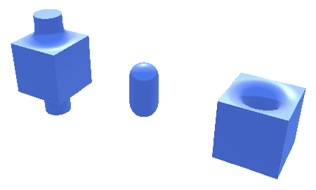
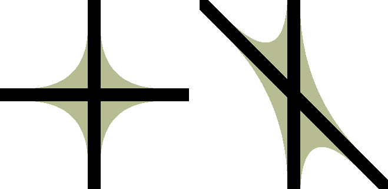
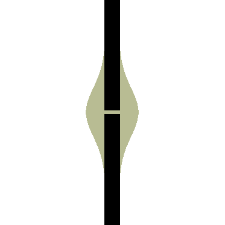

===============
The Shape Atlas
===============
The Shape Atlas is a catalog of operations for constructing,
transforming and combining 2D and 3D geometric shapes.

This is a research project to identify, classify and implement
all of the artistically useful operations on signed distance fields
(the representation Curv uses for geometric shapes).

Each operation will be given a provisional API, and sometimes we'll explore multiple
implementations with different tradeoffs.

The ultimate goal is to boil all of this research down into a well
designed, consistent and powerful geometry API for Curv, which will be
included in a future Curv standard library.

0. Shape Properties
===================

2D and 3D Shapes
----------------
Every shape is marked as being 2-dimensional, 3-dimensional, or both.
2D shapes are embedded in the XY plane.
(The only standard shapes that are both are ``everything`` and ``nothing``.)

Infinite and Degenerate Shapes
------------------------------
A shape can be infinite. Many shape constructors accept ``inf`` as a dimension argument.

A 2D shape with no area, or a 3D shape with no volume, is called degenerate.
Examples are geometric points, line segments or curves, and in 3D, surfaces with 0 thickness.

Points and curves are invisible in the preview window, while surfaces are visible.
Infinite and degenerate shapes are useful as intermediates for constructing
shapes, even though you can't 3D print them or export them to some file formats.

Colour
------
Shapes have volumetric colour.
A function assigns a colour to each point in the interior and on the boundary
of every 2D and 3D shape. Primitive shapes are assigned a default yellowish colour,
which you change using the ``colour`` function.
Shape operations must specify how the colour of the result shape derives from the
colour of the argument shapes.
(Colour assignment and colour transformation operators will be researched elsewhere,
in `<Colour_Atlas.rst>`_.)

Signed Distance Fields
----------------------
Shapes are represented internally as Signed Distance Fields (SDFs), see `<Theory.rst>`_.
This is not a unique representation: a given shape can be represented by many different SDFs.
In most cases, the user just wants to let the implementation choose an SDF that is fast
to compute and fast to render.

However, there are Distance Field Operations (see section 4)
that construct a shape based on the SDF of an input shape.
These operations are too useful to leave out.
For this reason, we document the class of SDF created by each shape operation.

These are the SDF classes:

exact:
  The distance field contains the exact Euclidean distance to the nearest boundary.
  The ``inflate`` operation will create a rounded offset.
mitred:
  Like exact, except vertex and edge information is preserved in all isosurfaces.
  This can be useful in conjunction with distance field operations.
  The ``inflate`` operation will create a mitred offset.
approximate:
  The SDF is implementation dependent, and may change between releases
  as the library is optimized.
bad:
  Worse than approximate: the SDF is Lipschitz continuous with a Lipschitz constant > 1.
  Sphere tracing won't work unless you correct the SDF using the ``lipschitz`` operator.
  The correction factor needs to be determined experimentally by the user.
discontinuous:
  Worse than bad: the SDF is not Lipschitz continuous, and can't be corrected by the ``lipschitz`` operator.
  This situation can occur when experimenting with ``make_shape``.

Bounding Box
------------
Each shape has an axis aligned bounding box, which may be either exact or approximate.
An approximate bounding box is larger than necessary to contain the shape.

All of the shape constructors create exact bounding boxes.
Some of the shape combinators produce exact bounding boxes if their input is exact,
(as documented), but many create approximate bounding boxes.

You need to worry about whether a bounding box is approximate or exact
if you use a shape combinator that uses the bounding box of its input
to determine the shape of its output.

1. Shape Constructors
=====================

2D Shapes
---------
``circle d``
  Construct a circle of diameter ``d``, centred on the origin.
  Exact distance field.

``ellipse (dx, dy)``
  Construct an axis-aligned ellipse, centred on the origin,
  with width ``dx`` and height ``dy``.
  Approximate distance field.
  
  * ``ellipse_e``: exact distance field, much more expensive to compute (TODO).

``square d``
  Construct an axis-aligned square of width ``d``, centred on the origin.
  
  * ``square_m``: mitred distance field, simple code, cheap to compute.
  * ``square_e``: exact distance field, more expensive.

``rect (dx, dy)``
  Construct an axis-aligned rectangle of width ``dx`` and height ``dy``,
  centred on the origin.
  
  * ``rect_m``: mitred distance field, simple code, cheap to compute.
  * ``rect_e``: exact distance field, more expensive.

``rect_at ((xmin,ymin), (xmax,ymax))``
  Construct an axis-aligned rectangle
  whose lower-left corner is ``(xmin,ymin)``
  and whose upper-right corner is ``(xmax,ymax)``.
  Unlike ``rect``, this function lets you construct
  half-infinite rectangles where, eg, ``ymin`` is
  finite but ``ymax`` is ``inf``.
  
  * ``rect_at_m``: mitred distance field
  * ``rect_at_e``: exact distance field (TODO)

``regular_polygon (n, d)``
  Construct a regular polygon, centred on the origin,
  with ``n`` sides, whose inscribed circle has diameter ``d``.
  Bottom edge is parallel to X axis.
  Cost: constant time and space, regardless of ``n``.
 
  * ``regular_polygon_m``: mitred distance field.
  * ``regular_polygon_e``: exact distance field (TODO).

  TODO: Calls to regular_polygon should compile into optimized code, like http://thndl.com/square-shaped-shaders.html

..
  Example: ``regular_polygon(5,1)``

..
  |pentagon|

.. |pentagon| image:: images/pentagon.png

``convex_polygon vertices``
  Construct a convex polygon from a list of vertices in counter-clockwise order.
  The result is undefined if the vertex list doesn't specify a convex polygon.
  Cost: linear in ``count(vertices)``.
 
  * ``convex_polygon_m``: mitred distance field.
  * ``convex_polygon_e``: exact distance field (TODO).

``polygon vertices``
  TODO. (Use the Nef Polygon construction, by combining a set of half-planes using intersection and complement.)

``stroke (d, p1, p2)``
  A line of thickness ``d`` drawn from ``p1`` to ``p2``,
  with semicircle end caps of radius ``d/2``.
  Exact distance field.

``half_plane_dn (d, n)``
  A half plane with normal vector ``n``,
  whose edge is distance ``d`` from the origin.
  ``n`` must be a unit vector.
  If d >= 0, the half-plane contains the origin.
  Exact distance field.

``half_plane_pn (p, n)``
  A half plane with normal vector ``n``,
  whose edge passes through point ``p``.
  ``n`` must be a unit vector.
  Exact distance field.

``half_plane_p2 (p1, p2)``
  A half-plane whose edge passes through points p1 and p2.
  Exact distance field.

``log_spiral ...``
  TODO: logarithmic spiral

``linear_spiral ...``
  TODO: linear (aka Archimedean) spiral

3D Shapes
---------
``sphere d``
  Construct a circle of diameter ``d``, centred on the origin.
  Exact distance field.

``ellipsoid (dx, dy, dz)``
  Construct an axis-aligned ellipsoid, centred on the origin,
  with width ``dx``, depth ``dy`` and height ``dz``.
  Approximate distance field.
  
  * ``ellipsoid_e``: exact distance field, much more expensive to compute (TODO).

``cylinder (d, h)``
  Construct a cylinder, centered on the origin, whose axis of rotation is the Z axis.
  Diameter is ``d`` and height is ``h``.
 
  * ``cylinder_m``: mitred distance field.
  * ``cylinder_e``: exact distance field, more expensive.

``cone (d, h)``
  Construct a cone.
  The base (of diameter ``d``) is embedded in the XY plane and centred on the origin.
  The apex is above the origin at height ``h``.
 
  * ``cone_m``: mitred distance field. (TODO)
  * ``cone_e``: exact distance field, more expensive.

``torus (d1, d2)``
  Construct a torus, centred on the origin, axis of rotation is Z axis.
  Major diameter is ``d1`` (center of tube to centre of tube, crossing the origin).
  Minor diameter is ``d2`` (diameter of the tube).
  Total width of shape is ``d1+d2``.
  Exact distance field.

``box (dx, dy, dz)``
  Construct an axis-aligned cuboid of width ``dx``, depth ``dy`` and height ``dz``,
  centred on the origin.
 
  * ``box_m``: mitred distance field.
  * ``box_e``: exact distance field, more expensive.

``box_at ((xmin,ymin,zmin), (xmax,ymax,zmax))``
  Construct an axis-aligned cuboid.
 
  * ``box_at_m``: mitred distance field.
  * ``box_at_e``: exact distance field, more expensive. (TODO)

``prism (n, d, h)``
  Construct a regular right prism, centred on the origin, of height ``h``.
  The base is a regular polyhedron with ``n`` sides, whose inscribed circle has diameter ``d``,
  parallel to the XY plane.
 
  * ``prism_m``: mitred distance field.
  * ``prism_e``: exact distance field, more expensive. (TODO)

``pyramid (n, d, h)``
  Construct a regular right pyramid.
  The base is a regular polyhedron with ``n`` sides, whose inscribed circle has diameter ``d``.
  The base is embedded in the XY plane and centred on the origin.
  The apex is above the origin at height ``h``.
  TODO

``tetrahedron d``
  Construct a regular tetrahedron, centred on the origin.
  Diameter of inscribed sphere is ``d``.
 
  * ``tetrahedron_m``: mitred distance field.
  * ``tetrahedron_e``: exact distance field, more expensive. (TODO)

``cube d``
  Construct an axis aligned cube (regular hexahedron), centred on the origin.
  Diameter of inscribed sphere (aka height of cube) is ``d``.
 
  * ``cube_m``: mitred distance field.
  * ``cube_e``: exact distance field, more expensive.

``octahedron d``
  Construct a regular octahedron, centred on the origin.
  Diameter of inscribed sphere is ``d``.
 
  * ``octahedron_m``: mitred distance field.
  * ``octahedron_e``: exact distance field, more expensive. (TODO)

``dodecahedron d``
  Construct a regular dodecahedron, centred on the origin.
  Diameter of inscribed sphere is ``d``.
 
  * ``dodecahedron_m``: mitred distance field.
  * ``dodecahedron_e``: exact distance field, more expensive. (TODO)

``icosahedron d``
  Construct a regular icosahedron, centred on the origin.
  Diameter of inscribed sphere is ``d``.
 
  * ``icosahedron_m``: mitred distance field.
  * ``icosahedron_e``: exact distance field, more expensive. (TODO)

``capsule (d, p1, p2)``
  A cylinder of diameter ``d`` whose central axis extends from ``p1`` to ``p2``,
  with the addition of hemispherical end caps of radius ``d/2``.
  Exact distance field.

``half_space (d, n)``
  A half-space with normal vector ``n``,
  whose face is distance ``d`` from the origin.
  Exact distance field.
  
``half_space (p1, p2, p3)``
  A half-space whose face passes through points p1, p2, p3, which are not colinear.
  The normal vector is obtained from the points via the right-hand rule.
  Exact distance field.
  TODO

``gyroid``
  The gyroid surface (`<https://en.wikipedia.org/wiki/Gyroid>`_)
  is an infinite, labyrinthine, curved surface that is popular in 3D printed art.
  
  The gyroid surface partitions 3D space into two mirror image but congruent subspaces.
  The Curv ``gyroid`` constructor is one of these subspaces.
  You can get the other subspace using ``complement gyroid``,
  and you can get the gyroid surface using ``shell 0 gyroid``.
  
  TODO: distance field is bad.

Polydimensional Shapes
----------------------
``nothing``
  A special shape, classified as both 2D and 3D,
  that contains no geometric points.
  It's the identity element for the ``union`` operation.

``everything``
  A special infinite shape, classified as both 2D and 3D,
  that contains all geometric points.
  It's the identity element for the ``intersection`` operation.

2. Boolean (Set Theoretic) Operations
=====================================

``complement shape``
  Reverses inside and outside, so that all points inside the argument
  shape are outside the result shape, and vice versa.
  But the boundary doesn't change.
  If the input is a finite shape, the output will be infinite.

``union (shape1, shape2, ...)``
  Construct the set union of a list of zero or more shapes.
  
  The colours of shapes later in the list
  take precedence over shapes earlier in the list.
  This follows the metaphor of ``union`` as an additive operation
  where later shapes are "painted on top of" earlier shapes.

  ``union`` is an associative operation with ``nothing``
  as the identity element, meaning it is a monoid.
  The empty list is mapped to ``nothing``.
  If all of the shapes have the same colour, then
  ``union`` is commutative.

``intersection (shape1, shape2, ...)``
  Construct the set intersection of zero or more shapes.
  
  The colour of the first shape takes precedence.
  This is the opposite of the ``union`` convention.
  It follows the metaphor of ``intersection`` as a subtractive operation
  where the first shape is primary, and subsequent shapes indicate which parts of
  the primary shape not to remove.
  It is consistent with the traditional definition
  of ``difference(s1,s2)`` as ``intersection(s1,complement(s2))``.

  ``intersection`` is an associative operation.
  The empty list is mapped to ``everything``.
  If all of the shapes have the default colour,
  then ``everything`` is the identity element,
  and ``intersection`` is commutative and a monoid.
  
``difference (shape1, shape2)``
  A binary operation that subtracts shape2 from shape1,
  preserving the colour of shape1.

``symmetric_difference (shape1, shape2, ...)``
  The result contains all of the points that belong to exactly one shape in the list.
  
  This is an associative, commutative operation with ``nothing`` as its identity element.

``shape1 >> add shape2``
  TODO: Same as ``union(shape1,shape2)``, but convenient for use in geometry pipelines.

``shape1 >> remove shape2``
  TODO: Same as ``difference(shape1, shape2)``, but convenient for use in geometry pipelines.
  
``shape1 >> crop shape2``
  TODO: Same as ``intersection(shape1, shape2)``, but convenient for use in geometry pipelines.

3. Transformations
==================
A transformation is an operation that maps a shape S1 onto another shape S2,
by mapping each point (x,y,z) within S1 onto the point f(x,y,z) within S2.

Rigid Transformations
---------------------
Distance-preserving transformations of 2D and 3D shapes.
If the input has an exact distance field, the output is also exact.

``move (dx,dy) shape``
  Translate a 2D or 3D shape across the XY plane.

``move (dx,dy,dz) shape``
  Translate a 3D shape.

``rotate angle shape``
  Rotate a 2D or 3D shape around the Z axis, counterclockwise,
  by an angle measured in radians.

``rotate (angle, axis) shape``
  Rotate a 3D shape around the specified axis, counterclockwise,
  by an angle measured in radians.

``rotate quaternion shape``
  TODO

``reflect_x shape``
  Reflect a 2D/3D shape across the Y axis/YZ plane,
  mapping each point (x,y)/(x,y,z) to (-x,y)/(-x,y,z).

``reflect normal shape``
  TODO

``at p t shape``
  Apply a transformation ``t`` to a shape,
  treating the point ``p`` as the origin point of the transformation.
  
  Example: ``square 2 >> at (1,1) (rotate(45*deg))``
  rotates the square around the point (1,1).

``align alignspec shape``
  Using the shape's bounding box,
  translate the shape to align it relative to the origin,
  as specified by ``alignspec``.
  TODO

Non-Rigid Transformations
-------------------------
Non-distance-preserving transformations of 2D and 3D shapes.

``scale k shape``
  Isotropic scaling by a scale factor of ``k`` of a 2D or 3D shape.

``scale (kx, ky) shape``
  Anisotropic scaling of a 2D or 3D shape across the XY plane.

``scale (kx, ky, kz) shape``
  Anisotropic scaling of a 3D shape.

``shear_x kx shape``
  2D horizontal shear, defined on 2D and 3D shapes, mapping ``(x,y,z)`` to ``(x + kx*y, y, z)``.
  If ``kx>0``, this maps a unit square to a right-tilting parallelogram of height 1 and width ``1+kx``.
  So ``shear_x 1`` will double the width of a square, and ``shear_x 2`` will triple the width.
  
  Want to specify the shear factor as a tilt angle, like SVG skewX(a) or CSS skew(a)?
  Use ``shear_x(tan a)``.
  The tilt angle is measured clockwise from the +Y axis, ``a==0`` means no tilt.
  
  TODO: distance field is bad.
  
``shear_xy (kx,ky) shape``
  3D horizontal shear, defined on 3D shapes, mapping ``(x,y,z)`` to ``(x + kx*z, y + ky*z, z)``.
  
  TODO

``taper_x k shape``
  2D dimensional taper along the Y axis.
  The x coordinate of each point in the shape is scaled based on the y height, and is mapped to ``x * (1 - y*k)``.
  At ``y==0`` there is no x scaling.
  
  Taper factor ``k==0`` means no tapering.
  For positive k, the width of the shape decreases with increasing Y height,
  reducing to zero (the vanishing point) at height ``y==1/k``.

  TODO: the distance field is bad.
  At present, the DF becomes infinitely bad in a region radiating out of the vanishing point,
  and sphere tracing fails if a ray goes through this region of chaos.
  
  The taper transformation maps an infinite number of points onto the vanishing point,
  which is a singularity. Fixing the distance field will be easier if we don't support shapes
  that contain the vanishing point within their bounding box.

generalized taper ...
  TODO

``twist d shape``
  Twist a 3D shape around the Z axis. One full revolution for each ``d`` units along the Z axis.
  Lines parallel to the Z axis will be twisted into a helix.
  
  TODO: distance field is bad.

``bend d shape``
  Take the upper half of the XY plane between X==-d/2 and X==d/2,
  and wrap that radially around the origin to cover the XY plane,
  by mapping rectangular coordinates in the source region to polar coordinates
  in the target region.
  
  TODO: bad distance field.

2D -> 3D Transformations
------------------------

``extrude d shape``
  ``extrude`` converts a 2D shape to a 3D shape,
  linearly extruding it equal distances along the positive and negative Z axis,
  with total height ``d``.
  Similar to Autocad ``extrude`` and OpenSCAD ``linear_extrude``.
 
  * ``extrude_m``: mitred distance field.
  * ``extrude_e``: exact distance field.

``revolve shape``
  The half-plane defined by ``x >= 0`` is rotated 90°, mapping the +Y axis to the +Z axis.
  Then this half-plane is rotated around the Z axis, creating a solid of revolution.
  Similar to Autocad ``revolve`` and OpenSCAD ``rotate_extrude``.

``cylinder_extrude (d, d2) shape``
  An infinite strip of 2D space running along the Y axis
  and bounded by ``-d/2 <= x <= d/2``
  is wrapped into an infinite cylinder of diameter ``d2``,
  running along the Z axis and extruded towards the Z axis.
  TODO

``helix_extrude (...) shape``
  TODO: a 2D shape is swept along a helix. Similar to AutoCAD ``helix`` command.
  Note that if you ``twist`` a cylinder around the Z axis, the cross section is egg-shaped,
  not circular. By contrast, applying ``helix_extrude`` to a circle gives you a helix with
  a circular cross section.

``stereographic_extrude shape``
  The entire 2D plane is mapped onto the surface of the unit sphere
  using a stereographic projection,
  and extruded down to the origin.
  TODO

3D -> 2D Transformations
------------------------

``slice_xy shape``

``slice_xz shape``

``slice_yz shape``

Repetition
----------
``repeat_x d shape``

``repeat_xy d shape``

``repeat_xyz d shape``

``repeat_mirror_x shape``

``repeat_radial reps shape``

``repeat_spiral ... shape``

``repeat_helix ... shape``

4. Distance Field Operations
============================
These operations construct a shape from one or more distance fields.
In one or more of the shape arguments, it's the structure of the distance field
that matters, and not just the shape represented by that distance field.

Thus, if you want predictable and repeatable behaviour, you should restrict
distance field arguments to shape expressions that are documented to produce
either an exact or a mitred distance field. In other cases, where the SDF is
only documented as "approximate", the implementation is subject to change.

For all of the distance field operations, we only guarantee to compute a "good"
bounding box estimate if the distance field arguments are exact. Otherwise, the
bounding box may be "bad" (too small to contain the resulting shape),
and the user may need to fix this by calling ``set_bbox``.

* The reason is, for distance field operations, we need a lower bound on the
  ratio by which the distance field underestimates the distance to the boundary
  in order to compute a good bounding box estimate.
  For mitred distance fields in general, there is no lower bound. It's possible
  to determine lower bounds for some shape operations, but not in general.
* Other approaches: Compute this lower bound (if available), and store it in the shape,
  which is added complexity. Or, use an automatic bounding box estimator that uses distance field evaluation.
  
Level Set Operations
--------------------
The level set at ``d`` of a distance field is the set of all points whose distance value is ``d``.
This is also called an isocurve (in 2D) or isosurface (in 3D).

``inflate d shape``
  Construct the shape bounded by the level set at ``d`` of the shape argument's distance field.
  
  * d > 0: inflate the shape, blow it up like a balloon.
  * d == 0: no effect.
  * d < 0: deflate the shape.
 
  If the distance field is exact, then you get the "rounded offset" of the shape.
  For positive (negative) ``d``,
  convex (concave) vertices and edges are rounded off
  as if by a circle or sphere of radius ``d``.
  [Also known as Minkowski sum (difference) of a circle or sphere of radius ``d``,
  or dilation (erosion) with a disk of radius ``d`` in Mathematical Morphology.]

  If the distance field is mitred, the result is a "mitred offset".
  Vertices and edges are preserved.
  
  Bounding box: If ``shape`` has an exact distance field, then we can compute a
  good bounding box, which is exact if ``shape`` has an exact bounding box.

``shell d shape``
  Hollow out the shape, replace it by a shell of thickness ``d`` that is centred on the shape boundary.

``pancake d shape``
  ``pancake`` converts a 2D shape into a 3D "pancake" of thickness d.
  The edges are rounded. The corners are rounded, if ``shape`` has an exact
  distance field, or sharp, if ``shape`` has a mitred distance field.

Morph Operations
----------------
In which we linearly interpolate between two distance fields.

``morph (k, shape1, shape2)``
  Linearly interpolate between the SDFs of shape1 and shape2.
  ``k=0`` yields shape1, ``k=1`` yields shape2.

``loft d shape1 shape2``
  Like ``extrude``, except that you specify a lower cross section (``shape1``)
  and a upper cross section (``shape2``)
  and we linearly interpolate between the two SDFs while extruding.
  Similar to Autocad ``loft``.

  TODO: bad distance field.

Nested Distance Fields
----------------------
In which the output of one distance field is fed as input to another distance field.

``perimeter_extrude perimeter cross_section``
  A generalized torus.
  Sweep the origin point of a 2D shape (called ``cross_section``) 
  around the perimeter (distance field zero points) of another 2D shape
  (called ``perimeter``).
  The ``cross_section`` shape is offset from the perimeter based its distance
  from the origin.

  If ``perimeter`` has an exact distance field, then it's like
  a Minkowski Sum of ``cross_section`` with the zero points
  of ``perimeter``, with ``cross_section`` held orthogonal to the XY plane.

  Example: ``torus (d1,d2) = perimeter_extrude (circle d1) (circle d2)``

  Example: ``revolve shape = perimeter_extrude (circle 0) shape``

  The behaviour when sweeping around a ``perimeter`` vertex
  depends on whether the ``perimeter`` shape has an exact or mitred distance
  field: the result is a rounded or sharp transition.
  If ``perimeter`` has an approximate distance field, then any
  deformations in that distance field will deform the ``cross_section``.

Blended Union, Intersection and Difference
------------------------------------------
A blended union is a generalized union that smoothly joins nearby objects.
The same code (which I call a "blending kernel") can also define
a blended intersection and a blended difference, which smooth away
new edges created by the intersection or difference. There are many blending
kernels.

Blending operations are sensitive to the
structure of the distance fields of their arguments.
A blended union uses the positive distance fields near the surfaces of the
shapes being blended to construct additional material to bridge the gaps
between the two shapes.

---------

The ``smooth`` blending kernel comprises:

* ``smooth_union r (shape1, shape2)``
* ``smooth_intersection r (shape1, shape2)``
* ``smooth_difference r (shape1, shape2)``

The parameter ``r`` controls the size/radius of the blending band.

``smooth_union`` is an implementation of what I call The Elliptic Blend,
since it creates a fillet with an elliptical shape. This blend is fast,
easy to use, and good enough for most purposes.

The Elliptic Blend is a popular blending operation that has been rediscovered or reinvented
many times; every author comes up with a different name and a different algorithm,
but the behaviour is the same:

* "The Potential Method for Blending Surfaces and Corners" by Hoffman and Hopcroft (1987).
  Their blend is controlled by 3 parameters: ``a`` and ``b`` control the blending radius,
  and ``λ`` controls the shape of the fillet. If you set ``a=b=r`` and ``λ=0``
  then you get The Elliptic Blend.
* A special case of the "superelliptic blend" by Rockwood & Owen (1987),
  "Blending Surfaces in Solid Modeling".
  The ellipse is generalized to a superellipse by passing an exponent as argument,
  and there are two ``r`` parameters, one for each shape being blended.
* Independently discovered by Christopher Olah (2011), called "rounded union" in ImplicitCAD.
* Faster implementation by Inigo Quilez as "opBlend", using his "polynomial smooth min" function.
* Even faster implementation by Dave Smith @ Media Molecule (2015), called "soft blend".
* Alternate implementation by MERCURY (same shape but different distance field), called "opUnionRound".

Note that ``smooth_union`` and ``smooth_intersection`` are binary operators:
they aren't associative and don't easily generalize to an arbitrary number of shapes.

Here are circles of diameter 2, combined using ``smooth_union`` with ``r`` values
1.2, 1.8, 2.4, 3.0, 3.6, 4.2, 5.0:

.. image:: images/blend.png

This looks very similar to the older "blobby objects" / "soft objects" / "`Metaballs`_" technique.
The Elliptic Blend is more general, since it works with all geometric shapes, not just circles and spheres.
But it's also less general, since it doesn't blend 3 or more shapes together
in an order-independent way.

.. _`metaballs`: https://en.wikipedia.org/wiki/Metaballs

Smooth blends can produce the artistic effect of "fillets" and "rounds" from mechanical engineering.
Here are ``smooth_union``, ``smooth_intersection`` and ``smooth_difference``
applied to a unit cube and a cylinder with ``r=.3``:

Here's the appearance of a fillet (with the same ``r``) for different
angles: 90°, 45°, 135°.

At 90°, the fillet is a quarter-circle with radius ``r``.
At other angles, the fillet deforms to an ellipse.
This might be bad for engineering, if you need a constant radius fillet,
but it's good if you are animating an organic form (like a leg attached to a torso),
and you want a constant-area fillet that looks realistic as the joint is animated.

Here's a fillet of a butt joint, same parameters as above.
To get a rounded fillet in this example, the rectangles must have exact distance fields,
so I used ``rect_e``. This shows that the bounding box of ``smooth_union`` can be
bigger than the bounding box of ``union``. It also shows an example of a "bulge".

The "bulge" behaviour of the Elliptic Blend is considered undesirable by many people,
and there are more sophisticated blends available that avoid it.
The bulge can also be used artistically: Quilez has used it to create knee and knuckle joints
in cartoonish creatures.

As a special case, ``smooth_union r (s, s)`` is the same as ``inflate (r/4) s``.
This is specific to my current code. This seems to be the worst case
for bounding box inflation, so we can use this to compute bounding boxes.

Distance field: approximate. Haven't seen a bad distance field during testing.

Bounding box: approximate.

TODO: enhance ``smooth`` blending kernel to support N-ary blends.

------

TODO: various blending kernels from MERCURY, like ``chamfer``.

TODO: investigate advanced blending primitives from "A Gradient-Based Implicit Blend",
http://citeseerx.ist.psu.edu/viewdoc/download?doi=10.1.1.592.5451&rep=rep1&type=pdf

5. Shape Debugging
==================
``with_axes shape``
  Add an X/Y or X/Y/Z axis display to the shape.

``show_bbox shape``
  Visualize the bounding box, so you can check if it is bad (too small to contain the shape).

``set_bbox bbox shape``
  Manually fix a bad bounding box.

``show_contours shape``
  Visualize a signed distance field by displaying contour lines.

``show_gradient (j,k) shape``
  Visualize a signed distance field by displaying gradient values.
  Gradient values < j are displayed in black.
  Gradient values > k are displayed in white.
  Gradient values between j and k are displayed using a spectrum,
  where j is red and k is violet.
  
  You can start with (1,2) then use binary search to find the
  Lipschitz constant of a distance field, by visual inspection.

``lipschitz k shape``
  Repair a distance field whose Lipschitz constant k is != 1.
  If k < 1 then rendering via sphere tracing is slower than necessary.
  If k > 1 then rendering will fail.
  The argument ``k`` is the actual Lipschitz constant of ``shape``.
  
  If an experimental shape isn't rendering correctly,
  then ``shape >> lipschitz 2`` is often a quick way to fix the problem.
  If the distance field is not Lipschitz continuous, then ``lipschitz`` can't help you.

6. Missing/Future Shape Operations
==================================

Mesh Import
-----------
I want the ability to import an STL file.

0. Import an STL file as a Nef polyhedron, naively constructed from half-spaces
   using intersection and complement. Evaluation time for the SDF is proportional
   to the number of triangles. Likely to be unusable for more than a thousand
   triangles.
   
   [Starting point: a Curv function that reads an STL file, returns a list of triangles.]

1. Try to optimize the above approach. Maybe build a balanced
   space partitioning tree at compile time, walk the tree during SDF evaluation.
   Maybe try to optimize the representation by combining adjacent coplanar triangles into polygons,
   detecting symmetries, etc.
   Our goal is to exactly reproduce the polyhedron described
   by the STL file. This will work much better, but we likely still won't be able to import
   the Yoda bust on Thingiverse (614278 triangles).
   This operation will only be useful for STL files that represent actual polyhedrons,
   with a relatively small number of faces. It won't be good for high triangle count
   approximations to curved surfaces.

2. Give up and claim that Yoda can't be represented as an SDF.
   Implement a hybrid geometry engine, where some shapes are represented
   as meshes, some are represented as SDFs, and some are hybrid unions of
   meshes and SDFs. Some operations work on all 3 representations (eg,
   affine transformations). Some operations work only on meshes, or only on SDFs.
   You can convert an SDF to a mesh (but not vice versa, maybe).
   A top level scene is a union of meshes and SDFs, rendered using some hybrid
   Z-buffer algorithm. But, there are a lot of Curv operations that won't work
   on Yoda, and the whole implementation is twice as complex.

3. Read the literature. Realize that Yoda is not a polyhedron, but a polyhedral
   approximation to an original model that has lots of curved surfaces.
   What we really want (for Yoda) is a more compact and efficient SDF that is an approximation
   to the polyhedron and reconstructs the curved surfaces while preserving edges.
   
   Compile a mesh to an efficient SDF representation that approximates the
   original STL, with knobs for tuning the approximation.
   AFAIK this is an expensive offline operation.
   Need to choose a compiled mesh representation (and file format),
   an (offline) compilation algorithm, and an evaluation algorithm.
   
   It's likely that Yoda will compile into a large representation.
   If all of the data is accessed each time the Yoda SDF is evaluated,
   then evaluation will be too slow. We'd prefer a compiled representation where only a small fraction
   of the data needs to be accessed when evaluating the SDF at a given point.
   
   The Universal Approximation Theorum states that a neural network can approximate
   a continuous function on a compact subset of R^3. So we can represent a mesh as a
   neural network, and use Deep Learning to train the network from a mesh.
   This is just a wild idea right now; I don't know how fast this would be or how good
   the results would be.
   
   Radial Basis Functions (RBFs) are often cited as an efficient representation.
   The hard part is efficiently converting the mesh to an RBF representation.
   (Also note that RBFs are one representation used for neural networks.)
   
   * FastRBF (http://fastrbf.com) is a commercial implementation of this.
   * "Implicit Surface Modeling Suitable for Inside/Outside Tests with Radial Basis Functions"
     (2007) http://citeseerx.ist.psu.edu/viewdoc/download?doi=10.1.1.602.4653&rep=rep1&type=pdf
   
   GPU-Accelerated Adaptively Sampled Distance Fields (2008):
   http://hyperfun.org/FHF_Log/Bastos_GPU_ADF_SMI08.pdf
   Input is a 2-manifold mesh, output is an ASDF (adaptively sampled distance field)
   which is then rendered on a GPU using sphere tracing. The ASDF should be more
   compact than a voxel array/octree.
   
   `Signed Distance Fields for Polygon Soup Meshes`_ (2014):
   Input is polygon soup. Triangles don't need to be correctly oriented,
   mesh doesn't need to be 2-manifold.
   The output is a voxel/octree representation of a SDF.

.. _`Signed Distance Fields for Polygon Soup Meshes`: http://run.usc.edu/signedDistanceField/XuBarbicSignedDistanceField2014.pdf

Convex Hull
-----------
An OpenSCAD operation that is difficult/expensive to implement in F-Rep.
It's a powerful and intuitive operation, so it would be nice to have for that reason alone.

Convex Hull is used to create a skin over elements that form the skeleton of the desired shape.
There are probably better and cheaper ways to accomplish this in F-Rep,
so this operation is not a must-have.

Convex hull of two copies of the same shape is equivalent to sweeping that shape
over a line segment: there is a separate "wanted" entry for Linear Sweep.

Minkowski Sum
-------------
An OpenSCAD operation that is difficult/expensive to implement in F-Rep.
I personally like Minkowski sum, but there is a learning curve in understanding
how it works. It's not intuitive to people who first encounter it.

The most common Minkowski sum idioms have cheaper direct implementations in F-Rep
which are also easier to understand.

* Rounded offset at distance d: Minkowski sum with a sphere of radius d, or ``inflate d``
  of a shape with an exact distance field.
* Shell: in Curv, ``shell``.
* Morph between two shapes: in Curv, ``morph``.
* Sweep a 3D solid along a 3D curve: This has its own entry in the wanted list,
  and might be easier than a general Minkowski sum implementation.

My intuition says that Minkowski sum ought to be implementable as a Nested Distance Field
operation on shapes with exact distance fields, analogous to ``perimeter_extrude``.
But it's not quite as simple as that, and an actual implementation is likely to be expensive.

Circle/Sphere Sweep of a Parametric Curve
-----------------------------------------
Eg, I'd like to sweep out a `trefoil knot`_ with a sphere,
using the parametric equations::

  x = sin t + 2*sin(2*t)
  y = cos t - 2*cos(2*t)
  z = -sin(3*t)

.. _`trefoil knot`: https://en.wikipedia.org/wiki/Trefoil_knot

This would be trivial if we could convert these parametric equations to implicit form,
but that is often difficult to obtain analytically, and accurate numerical solutions
can often be quite expensive (quoting "Image Swept Volumes", Winter and Chen).

So we are looking for some way to remove the heavy lifting from the trefoil knot SDF distance function.

For example, compile the parametric equations into a data structure that can be efficiently queried
by the distance function to produce a reasonable approximation of the curve.
Sample the parametric curve, either at regular intervals, or adaptively (higher sampling
rate where the curvature is higher). Put the sample values into a balanced space partitioning
tree structure. The distance function looks up the nearest sampled points in the tree
and uses interpolation to estimate the nearest point on the curve.

Linear Sweep
------------
Sweep an arbitrary 2D/3D shape along a 2D/3D line segment.

General Sweep
-------------
Sweep an arbitrary 2D/3D shape along an arbitrary 2D/3D curve.

General Extrude
---------------
Sweep an arbitrary 2D shape along an arbitrary 3D curve.
The shape is normal to the curve at all points.
A generalization of ``extrude``.

research:

* "Image Swept Volumes", Winter and Chen, http://vg.swan.ac.uk/vlib/DOWNLOADS/ISV.pdf

Splines
-------
* Sweep a spline curve using a circle/sphere in 2D/3D. Open or closed curve.
  This is a solved problem, see `Sphere Tracing`_.
* Construct a shape by filling the space bounded by a closed spline curve (2D)
  or surface (3D).

Pixelate
--------
Transform a 2D shape so that it appears to be made of uniformly sized and coloured pixels,
or transform a 3D shape to voxels. The goal is to create a common
artistic effect: eg, make a shape look like it was modeled in Minecraft.

Convolution
-----------
A low pass filter would remove high frequency components from a shape,
rounding off sharp vertices and edges, and in effect "blurring" the shape.
Mathematical convolution is a way to implement this.

Local Deformations
------------------
These operations treat a shape as a lump of clay,
in which local regions can be arbitrarily deformed
while leaving the rest of the shape unmodified.
They are found in `digital sculpting`_ programs like ZBrush.

.. _`digital sculpting`: https://en.wikipedia.org/wiki/Digital_sculpting

CorelDraw has Smear, Twirl, Attract and Repel operators,
which perform smooth local translations, rotations and +/- scaling.
This seems like a good starting point.
Antimony has Attract and Repel in open source.

Drawing Text using a Font
-------------------------
Signed distance fields are now considered the best way to render text using a GPU.
For example, the Qt graphics toolkit uses SDFs for text rendering.
This fits into Curv really well.

The trick is to convert each character into a discretely sampled SDF, stored in a texture.
This happens before SDF evaluation time (rendering).
During rendering, we do interpolated texture lookups to get the value of a character SDF at a point.

Conway Polyhedron Operators
---------------------------
Implement the `Conway polyhedron operators`_.
Existing polyhedron constructors like ``cube``, ``icosahedron``, etc, are modified so that they
can be used as input values.

* In OpenSCAD, by Kit Wallace: https://github.com/KitWallace/openscad/blob/master/conway.scad
* In JavaScript, by George Hart: http://www.georgehart.com/virtual-polyhedra/conway_notation.html

.. _`Conway polyhedron operators`: https://en.wikipedia.org/wiki/Conway_polyhedron_notation

Supershapes
-----------
Superquadrics were popularized by Alan Barr as a solid modelling primitive.
Includes superellipsoids, superhyperboloids, supertoroids.
See `Sphere Tracing`_ for distance functions.

Supershapes, constructed using the Superformula, are a generalization of Superquadrics.
Implicit function representation for supershapes: http://le2i.cnrs.fr/IMG/publications/PG05.pdf

Hypertextures
-------------
Using Perlin noise (fractal noise) to deform a shape.
See `Sphere Tracing`_.

Fractals
--------
Mandelbulber uses SDFs and sphere tracing to render fractals using a variety of different algorithms.
These algorithms could be packaged as Curv functions.

http://mandelbulber.com/

Voronoi Diagrams
----------------

7. Bibliography
===============
* John C. Hart, `Sphere Tracing`_
* Inigo Quilez, `Modelling with Distance Functions`_
* MERCURY, `hg_sdf`_: A glsl library for building signed distance functions
* Christopher Olah, `Manipulation of Implicit Functions With an Eye on CAD`_

.. _`Sphere Tracing`: http://graphics.cs.illinois.edu/sites/default/files/zeno.pdf
.. _`Modelling with Distance Functions`: http://iquilezles.org/www/articles/distfunctions/distfunctions.htm
.. _`hg_sdf`: http://mercury.sexy/hg_sdf/
.. _`Manipulation of Implicit Functions With an Eye on CAD`: https://christopherolah.wordpress.com/2011/11/06/manipulation-of-implicit-functions-with-an-eye-on-cad/
