What is Curv?
=============
|twistor| |shreks_donut|

.. |twistor| image:: images/torus.png
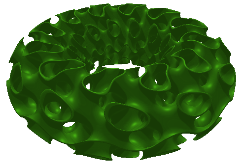

Curv is an open source 3D solid modelling language, oriented towards 3D printing, procedurally generated art, and mathematical visualization.

It's easy to use for beginners. It's incredibly powerful for experts.
And it's fast: all rendering is performed by the GPU.

Curv is also a uniquely expressive file format for the exchange of 2D and 3D
procedurally generated graphics.

Thesis
======
Ease of use:
  For ease of use, the best choice is Constructive Solid Geometry (CSG)
  embedded in a simple, pure functional language.

Rendering Speed:
  To quickly render a wide range of CSG primitives,
  the best choice is to render on a GPU,
  and to represent shapes using Function Representation (F-Rep).

Expressive Power:
  F-Rep is the best choice for CSG:
  A wider range of CSG primitives are available in Open Source for F-Rep
  than for competing representations.
  
  To boost expressiveness,
  the Curv language permits experts to define new CSG primitives using F-Rep.
  (Therefore, Curv functions must be compilable into GPU code.)
  
  F-Rep is the most expressive representation for controlling a 3D printer.
  It can describe 3D-printable objects that can't be modeled by competing representations.

Constructive Solid Geometry
===========================
In a Constructive Solid Geometry (CSG) system,
there is a set of primitive shapes,
and operations for constructing new shapes
by transforming and combining simpler shapes.
The operations normally include boolean operations like union, intersection and difference,
and affine transformations like translate, scale and rotate.

Curv uses CSG as its high level geometry interface,
and provides a rich set of predefined shapes and operations.
Both 2D and 3D shapes are supported.

Curv is a pure functional language in which shapes are first class values,
and CSG operations are functions that map shapes onto shapes.

Code for the twisted, coloured torus::

  torus (2,1)
    >> colour (radial_rainbow 1)
    >> rotate (tau/4, Y_axis)
    >> twist 3 >> lipschitz 2.2

Code for the model "Shrek's Donut"::

  smooth_intersection .1 (
    torus (tau*4, tau*2),
    gyroid >> shell .2 >> lipschitz 2 >> bend (tau*12),
  ) >> colour (hsv2rgb (1/3, 1, .5))

Function Representation
=======================
Internally, Curv represents geometric shapes using Function Representation (F-Rep).

In this representation, a shape contains functions that map every point (x,y,z) in 3D space onto the shape's properties, which may include spatial extent, colour, material.

F-Rep is the most expressive geometric representation.
Instead of approximating a shape using many copies of a single geometric primitive (like polygons, spline curves, or pixels),
or a fixed number of geometric primitives (vector representations),
F-Rep represents shapes using mathematical equations.
This means that exact representations of a vast number of geometric primitives are available.
F-Rep is compact and resolution independent. Shapes can be infinitely detailed, or infinitely large.

Curv provides a low level API for defining CSG primitives using F-Rep.
Using this API, the entire CSG geometry API is defined using Curv code.

A ``circle`` primitive can be defined like this::

  circle r = make_shape {
    dist(x,y,z,t) = sqrt(x^2 + y^2) - r,
    bbox = [[-r,-r,0], [r,r,0]],  // axis aligned bounding box
    is_2d = true,
  }

Pure Functional Programming
===========================
Curv is a pure functional language, with both shapes and functions as first class values.
Why?

* simple, terse, pleasant programming style
* simple semantics
* easy to translate into highly parallel GPU code
* good match for CSG and F-Rep
* security

Curv can be considered a file format for representing arbitrary geometric shapes
and distributing them across the internet. One requirement for such a file format
is security: when you open a shape file, you don't want the shape file to encrypt
all of your files and display a ransom message. Curv is not a general purpose
programming language. It doesn't have side effects, it can only compute values.
So it meets this requirement.

Unique contribution of Curv: pure functional + CSG + F-Rep in one language.

Secret agenda: Pure functional programming for beginners,
and for people who can't wrap their head around Haskell.

Competing Shape Representations
===============================
There are two important classes of representation for 2D and 3D shapes:

+-------------------------------------+-----------------------------------+
| **Explicit Modelling**              | **Implicit Modelling**            |
+-------------------------------------+-----------------------------------+
| Directly generate boundary points   | Answer questions                  |
|                                     | about particular points           |
+-------------------------------------+-----------------------------------+
| parametric equation (unit circle):: | implicit equation (unit circle):: |
|                                     |                                   |
|  (x,y) = (cos t, sin t)             |   x^2 + y^2 - 1 = 0               |
+-------------------------------------+-----------------------------------+
| **Boundary Representations**        | **Volumetric Representations**    |
+-------------------------------------+-----------------------------------+
| parametric splines                  | function representation           |
+-------------------------------------+-----------------------------------+
| triangle mesh                       | pixels (2D), voxels (3D)          |
+-------------------------------------+-----------------------------------+

These two classes have different strengths and weaknesses.
Certain operations that are cheap for one class are expensive
for the other class (and vice versa).

Conversions between the two classes are non-trivial:

* It's expensive to convert between parametric and implicit equations.
* It's expensive to convert between B-Rep and F-Rep.

Curv chooses F-Rep over B-Rep, but an engineering tradeoff is involved.

If you only know B-Rep procedural modelling, then learning F-Rep
requires you to think different if you want to write efficient programs.

F-Rep > Meshes
==============
Instead of triangular meshes (like OpenSCAD), Curv represents shapes as pure functions (Function Representation or F-Rep). Why?

0. F-Rep is a more powerful and expressive representation than meshes.
   Shapes can be infinitely detailed, infinitely large. Any shape that can be
   described using mathematics can be represented exactly.

1. Meshes are approximations, F-Rep is exact. As you apply a chain of successive geometry operations to a mesh,
   approximation errors can pile up.

2. With a mesh, simulating a curved surface with high fidelity requires lots of triangles (and memory).
   There is a tradeoff between accuracy of representation and memory/processing costs.
   F-Rep can represent curved surfaces exactly, at low cost.

3. The cost of mesh operations goes up, often non-linearly, with the number of triangles.
   For example, this is true for union and intersection.
   F-Rep can implement most common geometric operations, like union and intersection, in small constant time and space.

4. With a mesh, complex shapes with a lot of fine detail require lots of triangles and are very expensive.
   Examples are fractals, digital fabrics, metamaterials. OpenSCAD encounters these limits quite early.
   Many complex models that are 3D printable are out of reach.
   F-Rep can represent infinite complexity for free.

5. Unlike subtractive manufacturing (eg, CNC milling), or moulding, where you only control the boundary of an object,
   3D printing is an inherently *volumetric* manufacturing technology. 3D printers directly control the material placed at
   each voxel in a 3D volume. There is a slogan for this: In 3D printing, complexity comes for free.
   F-Rep is a volumetric representation, where functions map every point (x,y,z) in 3D space onto the properties of a shape. These properties include spatial extent, colour, material. F-Rep is a better way to program a 3D printer.

6. In the mesh world, important geometric operations like union and intersection
   are extremely complex and tricky to program. You don't implement these yourself, you use
   an expert implementation like CGAL or Carve. There are many more geometric operations available
   in open source for F-Rep than there are for meshes, and these operations are surprisingly easy
   to program. Eg, union and intersection are trivial.
   So it's practical for the entire Curv geometry library to be written in Curv itself,
   and it's much easier for users to define sophisticated new operations and distribute them
   as libraries.

7. F-Rep is well suited to being directly rendered by a GPU.

.. So Why Do People Use Meshes?
.. ============================
.. Historical reasons. The first consumer GPUs (1999) were designed to render meshes efficiently,
.. and did not support F-Rep at all. F-Rep had been used
.. by the movie industry since the 1980's, but was then far too expensive for real-time.
.. 
.. The video game industry drove the consumer GPU industry, and of course they standardized
.. on mesh representations. Today, all of the important games, game engines and dev tools use meshes
.. as the primary shape representation,
.. and that's why meshes are dominant. Modern games use F-Rep in a secondary role,
.. eg, for adding special effects to meshes.
.. 
.. For pure, meshless F-Rep to be practical for games, we need:
.. 
.. * GPUs with programmable pixel shaders (2001)
.. * Shader harder that is fast enough to support real time ray tracing of F-Rep (mid-2000's to present)
.. * Shader programming techniques that are good enough
..   (mid-2000's to the present, driven by the demo scene)
.. * A competitive F-Rep game engine is developed. (Still waiting. But see "Dreams", still unreleased.)
.. * A "killer app" to justify switching technologies.
..   Destructible terrain and in-game modelling have been proposed as benefits,
..   both based on cheap boolean CSG operations.
.. 
.. Trailer for "Dreams" by Media Molecule: https://www.youtube.com/watch?v=4j8Wp-sx5K0

Signed Distance Fields
======================
Curv uses a specific type of F-Rep called Signed Distance Fields
for representing the spatial extent of a shape.

A signed distance field is a function which maps each point in space
onto the minimum distance from that point to the boundary of the shape.
An SDF is zero for points on the boundary of the shape, negative for points
inside the shape, and positive for points outside of the shape.

A 2D shape, plus 3 views of its SDF:

|sdf1| |sdf2|

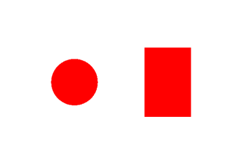
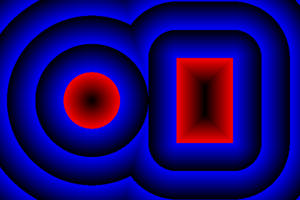

|sdf3a| |sdf3b|

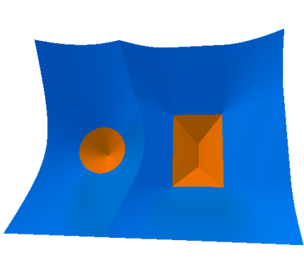
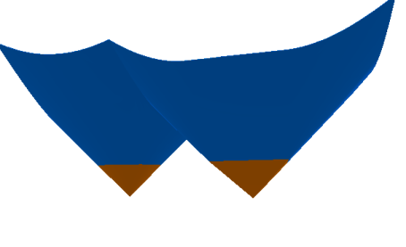

An SDF is continuous, and differentiable almost everywhere. At the differentiable points, the slope is 1, and the gradient points towards the closest boundary. (This is useful.) The non-differentiable points are equidistant between two boundary regions.

The singular points that occur inside a shape are called the (Topological) Skeleton or Medial Axis.
.. A tendril of the skeleton connects to the boundary of the shape at each (non-differentiable) convex corner or vertex point (2D) or edge (3D).

Isocurves and Isosurfaces
=========================
For a 2D SDF, the isocurve at C is the curve that comprises all points with the distance value C.
For a 3D SDF, the isosurface at C is the surface that comprises all points with the distance value C.

For example, here's the SDF for a rectangle. Some isocurves are visible as contour lines:

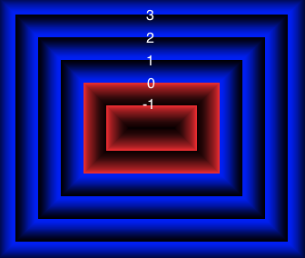

The isocurve at 0 for this SDF is just the boundary of the rectangle.

The isocurve at 1 bounds an "inflated" copy of the rectangle with rounded edges.
This is an important operation that has different names in different fields. The inflated copy is:

* The "rounded offset" of the rectangle, at offset 1 (CAD/Computer Aided Design).
* The Minkowski sum of the rectangle with a circle of radius 1 (Geometry).
* The dilation of the rectangle by a disk of radius 1 (Mathematical Morphology).

Similarly, isocurves or isosurfaces at negative values correspond to negative offsets, Minkowski difference,
or erosion from Mathematical Morphology.

.. If f(p) is an SDF,
.. then f(p)-C is the SDF for the shape bounded by the isocurve/isosurface of f at C.

Exact, Approximate and Mitred SDFs
==================================

In an Exact SDF, the distance field stores the exact distance from each point to the closest boundary. (This is also called a Euclidean SDF, since we are using the Euclidean distance metric, and some researchers use alternative metric spaces to construct SDFs.) We've been discussing Exact SDFs up to this point.

It turns out that it is sometimes difficult or expensive to construct Exact SDFs. So, a distance function is permitted to underestimate the distance to the closest boundary, and the result is an Approximate SDF (aka a Distance Estimator (DE), or sometimes a Signed Distance Bound).

The simplest and cheapest implementation of a rectangle has an Approximate SDF that looks like this:

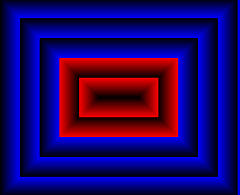

The positive isocurves of this SDF are also rectangles: they correspond to the "Mitred Offset" operation from CAD.
So I call this a Mitred SDF.
The skeleton tendrils attached to each vertex of the rectangle shoot out past the boundary and extend forever.

According to John C. Hart, author of the original academic papers on SDFs,
the only restriction is that an SDF cannot overestimate the distance from each point to the closest boundary.
In math terms, an SDF must be Lipschitz Continuous, with a Lipschitz constant of 1.
It's a continuous function which is limited in how fast it can change.
For every pair of points in an SDF, the absolute value of the slope of the line connecting
the points is not greater than 1.

.. * According to me, an SDF cannot have a derivative of zero at any point.
..   For example, if an SDF is 0 for all points in the interior of the shape,
..   that will break operations that care about the interior of a shape,
..   such as the ``complement`` operator.

An approximate SDF does not have all of the nice properties of an exact SDF.

* Away from the boundary, the gradient (if defined) is not guaranteed to point to
  the closest boundary point.
* A positive isosurface is not guaranteed to be the rounded offset of the shape.

A possible future direction is that shapes contain metadata which describes
the properties of their SDF. Shortcuts which rely on certain properties can
be enabled if the property is present.

SDF Techniques
==============
Early F-Rep systems used a simple representation. A geometry function ``f(p)`` indicates whether
the point ``p`` is inside, on the boundary, or outside of the shape, by returning 3 different values
(eg, a negative, zero or positive number).
This made it easy to write geometry functions. However, rendering was
very expensive. It was done by blind sampling of points in a 3D grid (lots of function evaluations).
It wasn't accurate: if a small detail fell between grid points, it was lost.

This led to a period of experimentation, searching for an F-Rep with fast, accurate rendering.
SDF won over the competition because it is the simplest such F-Rep that works.
It's relatively simple to define, relatively cheap to compute,
and doesn't require the distance field to have a derivative everywhere.

A Signed Distance Field contains a lot more information
than just inside/boundary/outside. This extra information is used for fast, accurate GPU
rendering, and by a number of rendering and modelling techniques:

* sphere tracing, aka ray marching
* collision detection: https://www.youtube.com/watch?v=x_Iq2yM4FcA
* controlling a 3D printer
  
  * powder printer: XYZ raster scan, optionally with colour or material
  * plastic printer: boundary/infill

* controlling a CNC mill (offsetting)
* soft shadows (ambient occlusion)
* gradients and normals

  * for Phong shading
  * for accurate polygonalization
  * for planting trees on the slopes of a fractal mountain

* fast, scaleable font rendering

The SDF Community
=================
Although SDFs are sometimes tricky to write,
there is an army of people in the open source community who are designing new SDFs.
Curv benefits by using this popular F-Rep representation and sharing SDFs with the community,
which includes:

* the demoscene: iquilezles.org, shadertoy.com, pouet.net
* the 3D fractal art community: fractalforums.com

Applications that use SDF:

* demoscene demos: shadertoy.com
* 3D fractal art tools: mandelbulber.com, mandelbulb.com
* CAD tools: ImplicitCAD.org, https://github.com/mkeeter/antimony, https://docs.racket-lang.org/ruckus/index.html
* Video games: "Dreams" by Media Molecule https://www.youtube.com/watch?v=4j8Wp-sx5K0
  (the motivation for using pure SDF is cheap boolean CSG ops for in-game modelling)

The Circle
==========
One way to construct the SDF for a shape is to start with the
shape's implicit equation, then algebraically transform it into a function
with the same roots, but with a Lipschitz constant of 1.

Implicit equation for a circle of radius ``r``::

  x^2 + y^2 = r^2

If we rearrange this to::

  x^2 + y^2 - r^2 = 0

then we have an implicit function that is zero on the boundary of the circle,
negative inside the circle, and positive outside the circle.
Although this is a Function Representation for a circle, it's not an SDF
because the function value at p
is the square of the distance from p to the origin, not the Euclidean distance.

We fix this by further transforming the equation::

  sqrt(x^2 + y^2) = r
  sqrt(x^2 + y^2) - r = 0

and now we have a proper Euclidean SDF.

A Curv circle implementation::

  circle r = make_shape {
    dist(x,y,z,t) = sqrt(x^2 - y^2) - r,
    ...
  }

Moral: Converting an implicit equation to an SDF requires care.
Typically, you will plot the candidate distance field, look for places where
the gradient isn't 1, and construct an inverse transformation that maps 0 to 0
(leaving the boundary alone), but modifies the field at other points so that the
gradient becomes 1.

Boolean Operations
==================
There are 3 primitive boolean operations on SDFs: union, intersection, and complement.
(Others, like difference and symmetric_difference, can be defined in terms of the primitives.)
These operations are closed over approximate SDFs. However, they map exact SDFs
to approximate SDFs.

The union of two shapes is the minimum of their distance fields::

  union(s1,s2) = make_shape {
    dist p = min(s1.dist p, s2.dist p),
    ...
  }

Union of a square and circle (both inputs are exact SDFs):

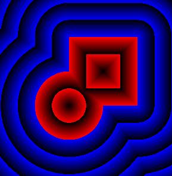

The resulting SDF is exact for any points outside of the shape, or at the boundary.
But the SDF is approximate inside the shape, in this case within the region where the circle and square intersect.

Intersection is computed using ``max``.

The complement operation negates the distance field (and converts finite shapes into infinite ones).

The Square
==========
In Curv, infinitely large shapes commonly have a simpler and cheaper representation
than finite shapes. A lot of finite shapes are constructed by intersecting two or more infinite shapes.
Most any shape with vertexes or straight line edges is probably built by intersection.

Let's construct a square of size ``2*r``.

We begin with an infinite half-plane, parallel to the Y axis,
which extends along the X axis from -infinity to +r:

+-----------------------+-------------+
| ``dist(x,y) = x - r`` |  |square1|  |
+-----------------------+-------------+

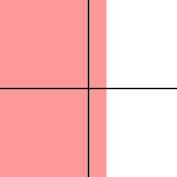
  
Now we will reflect the above half-plane through the Y axis,
using the ``abs`` operator.
The result is an infinite ribbon that runs along the Y axis,
bounded on the X axis between -r and +r:

+----------------------------+-------------+
| ``dist(x,y) = abs(x) - r`` |  |square2|  |
+----------------------------+-------------+

.. |square2| image:: images/square2.png

Now we will construct a similar ribbon that runs along the X axis:

+-----------------------------+-------------+
| ``dist2(x,y) = abs(y) - r`` |  |square3|  |
+-----------------------------+-------------+

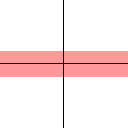

Now we intersect these two ribbons, using the ``max`` operator:

+---------------------------------------------+-------------+
| ``dist(x,y) = max(abs(x) - r, abs(y) - r)`` |  |square4|  |
+---------------------------------------------+-------------+

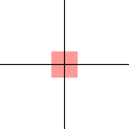

Curv is an array language, in which all arithmetic operations are generalized
to work on arrays. This is important for GPU compilation, since vectorized operations
run faster. So we will "vectorize" the above equation::

  dist(x,y) = max(abs(x,y) - r)

Here's a ``square`` operator that constructs a square of size ``d``::

  square d = make_shape {
    dist(x,y,z,t) = max(abs(x,y) - d/2),
    ...
  }

Transformations
===============
A transformation warps or transforms a shape in some way, by warping or transforming the
coordinate system in which it is embedded. The affine transformations are the most familiar
(translate, rotate, scale, etc) but any coordinate transformation is possible.

Translation::

  translate (dx,dy,dz) S = make_shape {
    dist(x,y,z,t) = S.dist(x-dx,y-dy,z-dz,t),
    ...
  }

To apply an affine transformation to a shape S, the transformation's distance function ``dist(p)``
performs the inverse of the transformation to the argument p before passing it to ``S.dist``.

For distance-preserving or rigid transformations (translate, rotate and reflect), that's all you need.
Otherwise, for non-rigid transformations (like scale, shear or twist),
the resulting distance field will be messed up, and needs to be fixed.

For isotropic scaling, fixing the distance field is easy::

  isoscale k S = make_shape {
    dist(x,y,z,t) = S.dist(x/k, y/k, z/k, t) * k,
    ...
  }

For anisotropic scaling, fixing the distance field requires an approximation::

  scale(kx, ky, kz) S = make_shape {
    dist(x,y,z,t) = S.dist(x/kx, y/ky, z/kz, t) * min(kx, ky, kz),
    ...
  }

Fixing the distance field can sometimes be tricky.
If you can put an upper bound D on the derivative of the broken distance field,
then divide the distance field by D and that's probably good enough.
If there's no upper bound, you need a more complicated fix.

Symmetry and Space Folding
==========================
The ``union`` operator is slow. The cost of a union is equal to slightly more than the sum of the
costs of the argument shapes. So if you have a shape that takes 1ms to render,
and you union together 1000 copies of this shape, well now it takes 1s to render.

Fortunately, Curv has repetition operators which union together an arbitrary
number of copies of a shape together, or even an infinite number of copies,
in constant time and space.

Each repetition operator corresponds to a different mathematical symmetry.
The most basic ones are:

* Mirror symmetry: Reflect a shape through a plane, giving two copies
  (the original shape and the mirror image).
* Translational symmetry: Partition space into multiple cells,
  like a linear array or grid pattern, causing a copy of the shape
  to appear in each cell.
* Rotational symmetry: Partition space into radial pie slices,
  causing a copy of the shape to appear in each slice.

Here's an example of translational repetition::

  sphere 1 >> repeat_xy (1,1)

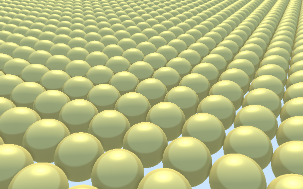

The ``repeat_xy`` operator is a coordinate transformation
that uses the modulus operator
to map coordinates in each cell onto the cell that is centered at the origin.
This has been called "space folding"::

  repeat_xy r shape = make_shape {
    dist(x,y,z,t) : shape.dist(
                mod(x + r[X], 2*r[X]) - r[X],
                mod(y + r[Y], 2*r[Y]) - r[Y],
                z, t),
    ...
  }

The use of symmetry to encode repetition is a key feature of Curv programming.
This allows you to generate huge amounts of complexity very cheaply.

Time and Animation
==================
In Curv, time is the fourth dimension.
Time is an extra parameter to distance functions and colour field functions.
An animation is a shape or colour field that varies in time.

Time is represented by a floating point number, measured in units of seconds,
like in ShaderToy. The zero point is arbitrary, and is not tied to clock time.
Eg, for a movie, the zero point is the beginning of the movie.

Animation is always "turned on". Individual shapes and colour fields can be
animated, in a modular way, without complicating their ability to be
included in larger assemblies. Like putting an animated GIF into a web page.

Time is relative. Since time is a coordinate, it can be transformed.
You can apply temporal transformations to speed up or slow down the passage
of time within a shape, loop over a specified time range, concatenate
a sequence of fixed length animations, etc.

You can define transformations that mix up time and space:

* create motion trails from an animation.
* motion blur: https://www.shadertoy.com/view/MdB3Dw
* transform a 3D static object into a 2D animation, or vice versa

Since time is a coordinate, animated 2D shapes are actually static objects
in 3D space-time, and animated 3D shapes are static objects in 4D space-time.
I intend to include time in the bounding box,
so we can represent fixed duration animations with a start and end time.

I considered making time a global variable, like in OpenSCAD or Newtonian physics, but this design is more awesome.

A future goal is to import and export animated GIFs and video files.

Morphing
========
Morphing from one shape to another is easy:
linear interpolation between two distance fields.

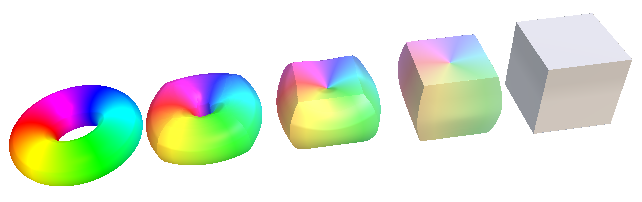

.. Convolution
.. ===========
.. In Photoshop, there are image processing filters that blur an image.
.. In the mathematics of image processing, this is called convolution.
.. (The inverse operation, sharpening an image, is deconvolution.)

.. Convolving a 3D shape means rounding or bevelling exterior corners and edges,
.. and filleting or chamfering interior corners.

.. Convolution is a binary operator that takes two functions,
.. the shape to be blurred, and a "convolution kernel".
.. There are lots of convolution kernels, allowing for a variety of effects.

.. I'd love to have a convolution operator.
.. There are lots of academic papers on convolution as an F-Rep operation.
.. But I have no code for an SDF system yet.

.. If you use numerical methods then it is (allegedly) slow, so many people
.. use symbolic algebra to convolve the F-Rep equation of a shape, which would
.. have to be done using a tool like Mathematica, outside of Curv.
.. The Curv geometry compiler already does a limited amount of symbolic algebra
.. to compile Curv code into efficient GPU code, so this suggests a future direction.

.. http://www.sciencedirect.com/science/article/pii/S0747717111002197

Blending
========
Blends smoothly join nearby objects.
Here are two circles, combined using different blending factors:

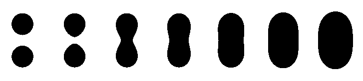

One application is filleting::

  smooth_union .3 (cube 1, cylinder(.5,2))

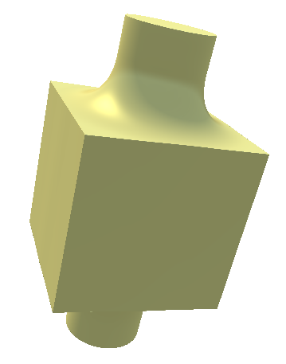

Another application is "Skeleton Based Implicit Modelling",
as illustrated by this image from the "Implicit Seafood" web site:

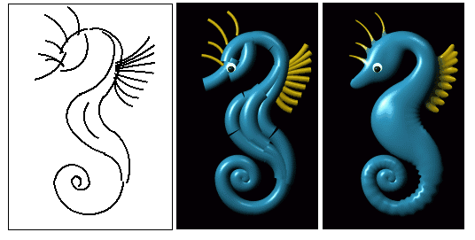

Generalized Blends
==================
Blending operators are like generalized unions,
but the same code (which I call a "blending kernel")
can also be used to define generalized intersections.

A blended union takes two shapes, plus a "blending kernel",
adding a "fillet" to interior corners created by the union.
A blended intersction takes two shapes plus a blending kernel,
rounding away material from exterior corners created by the intersection.
There is also blended difference.

Here are some blending kernels from ``MERCURY.sexy``, a demoscene group:

Round:
  |uRound| |iRound|

Chamfer:
  |uChamfer| |iChamfer|

Stairs:
  |uStairs| |iStairs|

Columns:
  |uColumns| |iColumns|

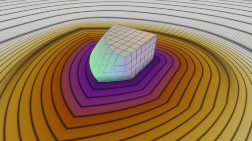
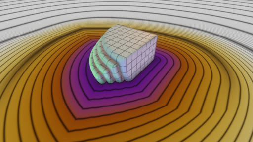
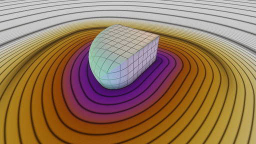
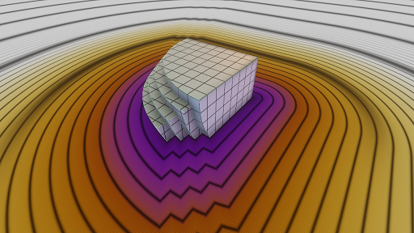
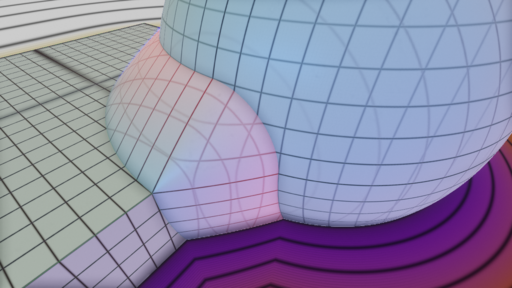
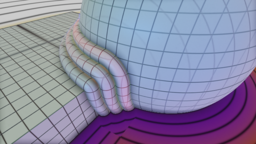
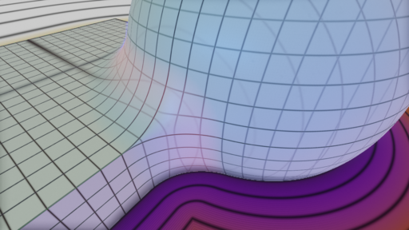
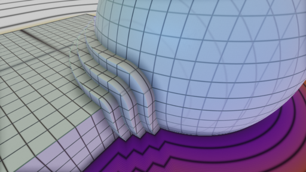

As you see, you can program a wide range of "decorative moulding" patterns.

.. How do you code a blending kernel... ?

.. A blending kernel is a pair of related functions, ``fillet`` and ``round``,
.. that map two distance values ``d1`` and ``d2`` onto a distance value.

.. ``fillet`` is used for blended union, replacing ``min`` in the standard implementation of ``union``.
.. The ``fillet`` function adds additional material to the shape being constructed, in the region above the
.. point or edge where two unioned shapes come together.
.. If either ``d1`` or ``d2`` is greater than the fillet radius,
.. then ``fillet`` defaults to the behaviour of ``min``.
.. Otherwise, if ``d1>0 && d2>0``, then the current point is inside the fillet region.

.. replacing ``min`` and ``max`` in the standard implementation of ``union`` and ``intersection``.

.. Embossing and Engraving
.. =======================

.. Sweep
.. =====
..   * extrude and loft
..   * perimeter_extrude (sweep 2D shape along 2D implicit curve -> 3D shape)
..   * isosurface (sweep circle along 2D curve, sphere along 3D curve or surface)
..   * constructing implicit curves and surfaces
  
..     * shell
..     * MERCURY: intersection->curve
    
..   * sweeping a parametric curve or surface: more expensive
..   * space warp operators/fancy blending operators can be an alternative to sweeping

.. Procedural Modelling Techniques
.. ===============================
.. * Hypertexture: engraving/perturbing the surface of a solid. An implicit modelling technique.
.. * Grammars, L-Systems

..   * Use a context free, generative grammar to generate a complex shape, like a tree, leaf or city.
..     Or fractals.
..   * during the 1990's: use L-System to generate a skeleton, then flesh it out
..     using F-Rep. Popular for modelling living things. See "algorithmic botany"
..     and "implicit seafood" web sites.
..   * idea: use a grammar to generate a tree of space folding operations: more complexity with fewer operations.

Fractals
========
SDFs and the Sphere Tracing algorithm were first described by inventor John C Hart in 1989
as an efficient algorithm for ray tracing (and thus visualizing) 3D fractals.
Today it is still the best technique.

For large or deeply iterated 3D fractals,
SDFs still win over other representations like triangle meshes or voxels:
they require too much memory,
and performing CSG operations like union or intersection on these
bulky representations is too time consuming.

For the 3D fractal art community, SDFs are the technology of choice,
because they are the basis for popular tools like MandelBulber and MandelBulb3D.

The following image is a deep zoom into a MandelBox fractal using MandelBulb3D.
Because Curv uses the same internal representation (SDFs),
the same model should be portable to Curv.

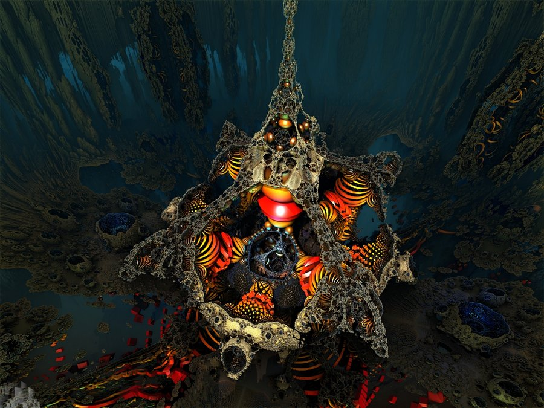

https://www.youtube.com/watch?v=OW5RnrlTeow

Fractal Noise
=============
A noise function maps each point in 2D or 3D space onto a pseudo-random noise value in the range [0...1].

Fractal noise is a popular noise function, good for simulating natural phenomena
like smoke, flames, clouds, mountains, and solid textures like marble or wood.

Here's a 3D solid texture I hacked together in Curv using fractal noise:

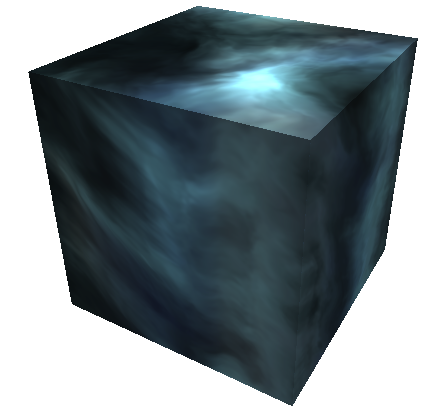

* White noise: Each (x,y) or (x,y,z) coordinate
  is mapped to a uniformly distributed pseudo-random number
  using a hash function.
  
  |white_noise|
* Value Noise: Random values are generated at lattice points.
  The noise value at a point is interpolated from nearby lattice points.
  
  |value_noise|
* Gradient noise: Random gradients are generated at lattice points. The gradient of a point
  is interpolated from the nearby lattice points. The gradient is converted to a noise value.
  Smoother than value noise, with fewer grid artifacts.
  (Examples: Perlin noise, Simplex noise.)
  
  |gradient_noise|
* Fractal noise (Fractal Brownian Motion):
  Gradient noise is generated at a series of higher frequencies (smaller lattice spacings),
  and added together. Higher frequencies are attenuated.
  
  |fractal_noise|

Many more noise functions have been invented.

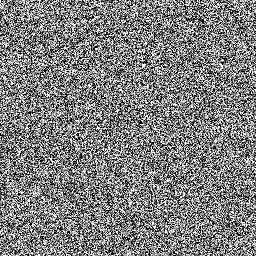
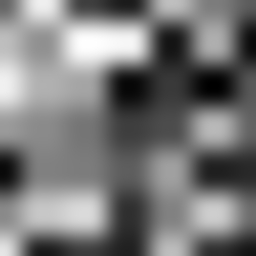
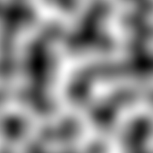
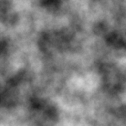

Sphere Tracing
==============
Sphere Tracing (sometimes called "ray marching") is the variant of ray tracing used to render SDFs on a graphics display.
It's efficient enough to support real time animation of an SDF using a GPU.
Sphere Tracing and the SDF representation were invented together, by John C Hart,
to solve the problem of fast, flexible, accurate ray tracing for Function Representation.

To render a scene using Sphere Tracing,

0. Construct a single SDF representing the entire scene,
   eg by unioning together multiple components.
1. For each pixel on the viewport, cast a ray of sight into the scene.
   Using a GPU, multiple rays are cast in parallel.
2. The Sphere Tracing algorithm is used to advance the ray through the SDF
   until the ray hits a surface boundary.
   The SDF is sampled at the initial point, giving a value D. This is a distance estimate:
   the surface is at least D units away, maybe more. Advance the ray by D units,
   then iterate. Once D is sufficiently close to zero, we have reached the surface.
3. Once the ray reaches the surface, then we use a colour and lighting model to compute
   the pixel colour at that point on the surface.

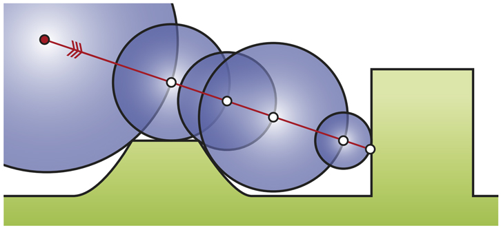

Here's how we colour and light the pixel in Curv:

* Each shape has a ``colour`` function that computes the colour at a given point.
* By taking 3 extra samples of the SDF around the surface point, in the pattern of a right tetrahedron,
  we compute the gradient of the distance field at that point, which gives us a surface normal,
  which is used for Phong shading.
* "Ambient Occlusion" is a cheap method for simulating shadows in real time without the expense of recursive ray-tracing,
  by leveraging the information stored in the SDF.

Hierarchical SDFs
=================
Naive: cost (N-ary union) = sum of the costs of the N arguments. Too expensive for large N.

Smart: partition space into disjoint subspaces. Maybe use multiple levels or a tree structure.
During SDF evaluation, first determine what subspace you are in (eg by walking the tree),
then evaluate the SDF for that subspace.

Can be done manually, using F-Rep API, but nicer to do it automatically. Eg,

Dreams by Media Molecule https://www.youtube.com/watch?v=4j8Wp-sx5K0

Shape Values in Curv
====================
In Curv, a shape value may be 2D, 3D, or both.
The dimensionality is used to choose whether the 2D or 3D viewer is used,
and to determine if the shape is eligible for export to various graphic file formats.
There is a single distance function used by both the 2D and 3D cases.

A shape value is represented by a record, with fields:

* ``dist`` is a function mapping ``(x,y,z,t)`` onto a signed distance value.
* ``colour`` is a function mapping ``(x,y,z,t)`` onto a colour (an RGB triple).
* ``bbox`` is an axis aligned bounding box, since this is expensive to compute from the distance function.
* ``is_2d``: a boolean
* ``is_3d``: a boolean

In the future, I'd like to support multiple shape subclasses,
with specialized CSG operations that work only on shape subtypes.
For example, I'd like to implement the Conway polyhedron operators
(which transform one polyhedron into another). Polyhedrons will contain
vertex/edge/face information.

Compiling Curv to GPU Code
==========================
The Geometry Compiler translates a shape to GPU code for rendering that shape.

For rendering on a display, the shape's distance and colour functions
are compiled into an OpenGL fragment shader.
In future, for converting a shape to a triangle mesh,
the distance function will be compiled to an OpenCL or CUDA compute kernel.
(I could also target the DirectX (Windows), Metal (macOS) and Vulkan APIs.)

Whatever the format, GPU compute kernels are written in a primitive
subset of C which lacks recursive functions and memory allocation,
and has limited support for pointers and global variables.
If I target WebGL, there is only limited support for iteration.

Here's how GPU code generation works:

* Evaluate a Curv program, producing a shape value.
* Extract the ``dist`` and ``colour`` functions, which are closures.
* Partially evaluate the body of the closure,
  treating non-local variables captured by the closure as compile time constants,
  folding constant subexpressions, and optimizing.
* Function calls are inline expanded to eliminate recursion and polymorphism,
  and enable more partial evaluation.
* The resulting transformed code is restricted to a statically typed
  subset of Curv called "GL", which can be compiled into GPU code.
* A distance function can use operations and data types that are not part of GL,
  as long as those subexpressions are partially evaluated into something that
  is supported.

As I extend the F-Rep API to make Curv faster and more powerful,
the GL subset of Curv is growing to embed an increasingly larger subset of the GLSL shader language.
