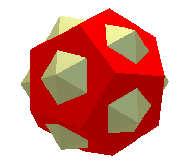

Functions
---------
A function ``f`` is a value that maps an argument ``x`` onto a result ``f x``.

Functions are pure. The result of a function call depends only on its argument value.
(In other words, a function cannot consult shared mutable state to compute its result.
This is a feature of imperative programming languages, and Curv is a pure functional language.)

Functions with One Argument
~~~~~~~~~~~~~~~~~~~~~~~~~~~
Function call is a binary operator with two operands, the function and its argument,
which are juxtaposed or separated by a space. You can write ``f(x)``, but the parentheses
are not a required part of function call syntax.

``identifier -> expression``
  This is a function literal.
  For example, ``x->x+1`` is a function that maps its argument ``x``
  onto the value of ``x+1``.
  If ``incr=x->x+1`` then ``incr 2`` is ``3``.

Functions with Multiple Arguments
~~~~~~~~~~~~~~~~~~~~~~~~~~~~~~~~~
There are 3 ways to simulate a function call with more than one argument.
Let's consider a function called ``plus`` which takes 2 arguments
and returns their sum. Here are 3 variants:

* ``plusl (2,2)`` -- The argument is a list.
  This simulates a conventional function call with positional arguments.
* ``plusr {x:2, y:2}`` -- The argument is a record.
  This gives us function calls with labelled arguments.
* ``plusc 2 2`` -- This is called a Curried function.
  How it works: ``plusc 2`` returns a function that maps its argument ``y`` onto ``2+y``.

Let's define the 3 variants of ``plus``::

  plusl = (x,y) -> x + y;
  plusr = {x,y} -> x + y;
  plusc = x -> y -> x + y;

The definitions of ``plusl`` and ``plusr`` use the patterns ``(x,y)`` and ``{x,y}``
as their parameter specification.
The pattern ``(x,y)`` requires the argument to be a two element list—otherwise, the pattern match fails.
It binds the list elements to the parameters ``x`` and ``y``.
Similarly, the pattern ``{x,y}`` requires the argument to be a record with exactly two
fields named ``x`` and ``y``. It binds those field values to the parameters ``x`` and ``y``.
Patterns are described in more detail later.

There is a shortcut syntax for function definitions::

  plusl (x,y) = x + y;
  plusr {x,y} = x + y;
  plusc x y = x + y;

Definitions are described in more detail later.

Pipelines
~~~~~~~~~
Curv programs often contain deeply nested function calls,
which happens when you chain a sequence of geometric transformations.
Pipelines are an alternative syntax for nested function calls, which are
easier to read and write.

The following shape expression::

  colour red (rotate (45*deg) (cube 10))

can be rewritten as a pipeline::

  cube 10
   >> rotate (45*deg)
   >> colour red

You read a pipeline from left to right, like a Unix shell pipeline.
Take a cube of size 10, then rotate it 45 degrees, then colour it red.
The data flows from left to right, through a series of transformations.

Briefly, ``x >> f`` means ``f x``.
There is also a reverse pipeline operator, ``f<<x``, which is less frequently used.

Infixes
~~~~~~~
``a `f` b`` is an alternate syntax for ``f(a,b)``.

Some functions which look good when used in infix form:

+--------------------------------------+-------------------------------------+
| ``a `mod` m``                        | ``mod(a,m)``                        |
+--------------------------------------+-------------------------------------+
| ``a `max` b``                        | ``max(a,b)``                        |
+--------------------------------------+-------------------------------------+
| ``l1 `concat` l2``                   | ``concat(l1,l2)``                   |
+--------------------------------------+-------------------------------------+
| ``v1 `dot` v2``                      | ``dot(v1,v2)``                      |
+--------------------------------------+-------------------------------------+
| ``icosahedron `union` dodecahedron`` | ``union(icosahedron,dodecahedron)`` |
+--------------------------------------+-------------------------------------+

An infixed function name has the same precedence as the ``>>`` operator,
and so can be used as a pipeline element:

+------------------------+----------------+
| ::                     | |dodeca-icosa| |
|                        |                |
|   dodecahedron         |                |
|    >> colour red       |                |
|    `union` icosahedron |                |
+------------------------+----------------+

Switch
~~~~~~
``switch`` is named after the C switch statement, since they both implement multi-branch conditionals.

``switch function_list``
  ``switch`` is an ordinary function whose argument is a list of functions.
  ``switch`` returns a function .......
