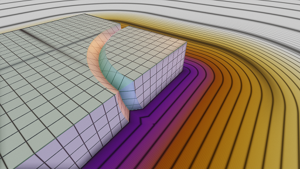
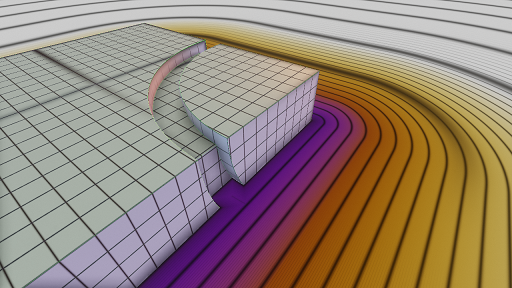
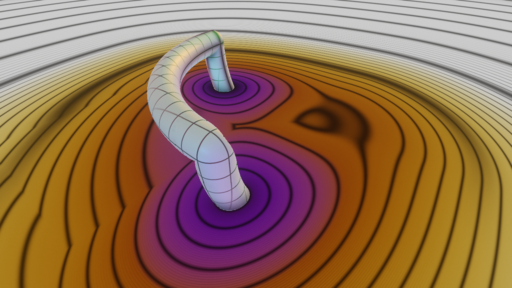
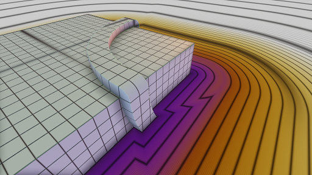

``lib.blend`` defines a collection of blending operators,
which combine two shapes to create a new shape.
They work in 2D and in 3D.

Some of these operators are generalized Boolean operations.

* A blended union is a generalized union that adds additional material, such as a fillet or chamfer,
  at the edges where two shapes meet.
* A blended intersection or difference removes material from the edges where two shapes meet,
  which can produce a rounded or chamfered edge.

Summary of the blended Booleans:

=========  =============
Name       Effect
=========  =============
smooth     Rounded or filleted joins and edges
chamfer    Chamfered joins and edges
stairs     Staircase effect
columns    Scalloped effect
=========  =============

Summary of the non-Boolean blends:

=========  =============
Name       Effect
=========  =============
pipe       Produces a cylindical pipe that runs along the intersection.
           No objects remain, only the pipe.
engrave    First object gets a v-shaped engraving where it intersects the second.
groove     First object gets a carpenter-style groove cut out.
tongue     First object gets a carpenter-style tongue attached.
=========  =============

Boolean Blends
==============
The boolean blends are represented by values called "blending kernels".
A blending kernel is a record with 3 fields named ``union``,
``intersection`` and ``difference``. These fields are functions that
take a list of 2 shapes as an argument.

For example, the ``smooth r`` blending kernel comprises:

* ``smooth r .union [shape1, shape2]``
* ``smooth r .intersection [shape1, shape2]``
* ``smooth r .difference [shape1, shape2]``

``smooth r``
  This blend creates a 1/4 circle fillet (if the two shapes meet at
  90°) or an elliptical fillet in the general case.
  The parameter ``r`` controls the size/radius of the blending band.

  |uRound| |iRound|

``chamfer r``
  Makes a 45-degree chamfered edge (the diagonal of a square of size ``r``).

  |uChamfer| |iChamfer|

``stairs [r, n]``
  Staircase effect. ``r`` is related to the size of the blending band.
  ``n`` is the number of steps:
  the number of stairsteps added to a union,
  or the number of grooves cut out of an intersection.
  
  WARNING: this feature is experimental, the API may change.
  PROBLEMS: What is the relationship of the ``r`` parameter to the size
  of the blending band? Once I find out, I may change the meaning of the
  parameter to make it more rational/predictable.

  |uStairs| |iStairs|

``columns [r, n]``
  Scalloped effect.
  ``r`` is somehow related to the size of the blending band.
  ``n`` is somehow related to the number of columns.

  WARNING: this feature is experimental, the API will change.
  PROBLEMS: the parameters don't make sense and the distance field is bad.
  
  |uColumns| |iColumns|

Non-Boolean Blends
------------------
``pipe d [s1, s2]``
  Produces a cylindical pipe of diameter ``d``
  that runs along the intersection of shapes ``s1`` and ``s2``.
  
  WARNING: bad distance field.

  |Pipe|

``engrave r [s1, s2]``
  Shape ``s1`` gets a V-shaped engraving where it intersects shape ``s2``.
  The V-shaped trench has depth ``r`` and width ``2*r``.

  |Engrave|

``groove [ra, rb] [s1, s2]``
  Shape ``s1`` gets a carpenter-style groove cut out where it intersects shape ``s2``.
  The groove has depth ``ra`` and width ``2*rb``.

  |Groove|

``tongue [ra, rb] [s1, s2]``
  Shape ``s1`` gets a carpenter-style tongue attached where it intersects shape ``s2``.
  The tongue has height ``ra`` and width ``2*rb``.
  
  |Tongue|

.. |iChamfer| image:: ../images/fOpIntersectionChamfer.png
.. |iColumns| image:: ../images/fOpIntersectionColumns.png
.. |iRound| image:: ../images/fOpIntersectionRound.png
.. |iStairs| image:: ../images/fOpIntersectionStairs.png
.. |uChamfer| image:: ../images/fOpUnionChamfer.png
.. |uColumns| image:: ../images/fOpUnionColumns.png
.. |uRound| image:: ../images/fOpUnionRound.png
.. |uStairs| image:: ../images/fOpUnionStairs.png

Technical Details
-----------------
Blending operators are distance field operations,
and are thus subject to the constraints described here:
`<../shapes/Distance_Field_Operations.rst>`_.

For more information, see:

* The Blending section of `<../Theory.rst>`_
* `<http://mercury.sexy/hg_sdf/>`_, which inspired many of the operations in ``lib.blend``.
* The source code, `<../../lib/curv/lib/blend.curv>`_.
